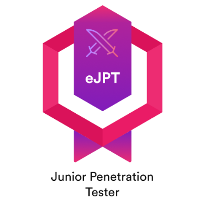

<h1 align="center">Hi, I'm InferiorAK</h1>
<h3 align="center">Cybersecurity Professional from Bangladesh 🇧🇩</h3>

  
  

  

  

---

## About Me

- **Cybersecurity professional** focused on **Red Teaming** and **Penetration Testing**.
- Strong **Purple Team** mindset with hands-on **Blue Teaming** and **Linux hardening** experience.
- Consistent CTF competitor with **100+ CTF participations** and **1000+ solved challenges**.
- **Founder & Team Lead** of **Integrated Hawkers**, a recognized CTF team in Bangladesh.
- Certified in **eJPT** and trained in **Linux System Administration** (KodeKloud / LFS101).
- I automate security workflows using **Python** and **Bash**.

## Certifications

  
  

---

## My Links

---

<!-- ## ☕ Support Me

  

--- -->

## Profile Statistics

  
  

    

---

## GitHub Highlights

  

  

---

## Skills

---

## Featured Projects

  
  
  
  
  
  
  

<h3 align="center">
  <a href="https://github.com/inferiorak?tab=repositories">Explore More Repositories</a>
</h3>

---

  
  
  

